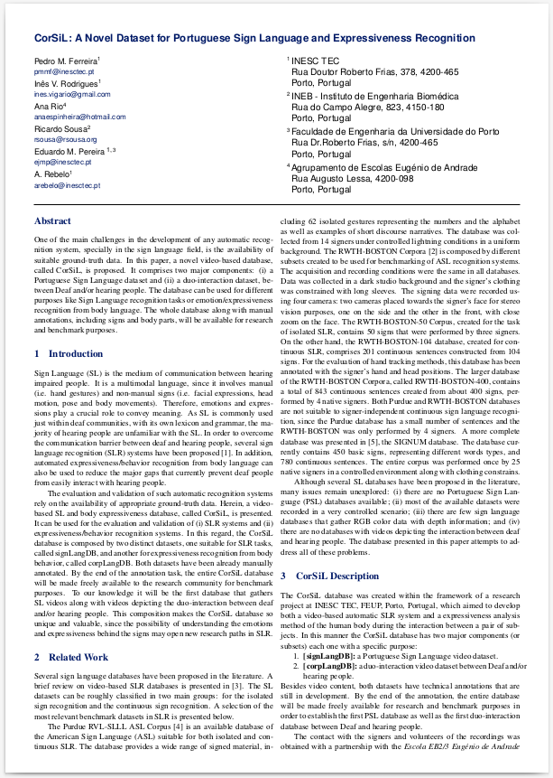
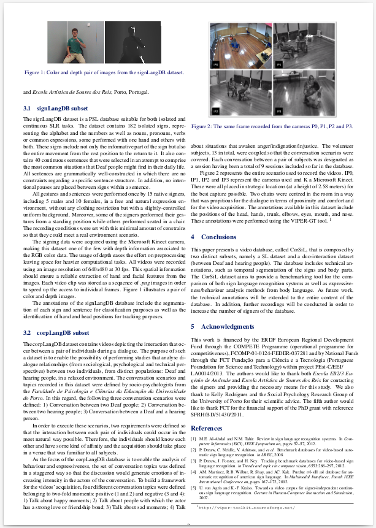

# CorSiL
**A Portuguese Sign Language and Expressiveness Recognition Database**

### Brief description

One of the main challenges in the development of any automatic recognition system, especially in the sign language field, is the availability of suitable ground-truth data. 

Here, a novel video-based database, called CorSiL, is presented. It comprises two major components: 
- **(i) a Portuguese Sign Language (LGP) dataset**
- **(ii) a duo-interaction dataset, between Deaf and/or hearing people**.

The database can be used for different purposes like Sign Language recognition tasks or emotion/expressiveness recognition from body language.

### CorSiL full description

|   |  |
|:---:|:---:|

### Get acess to the database

Both datasets have been already **manually annotated**. The entire CorSiL database is already freely available to the research community for benchmark purposes. 

If you want to have acess to CorSiL please send us an email to pmm@inesctec.pt
